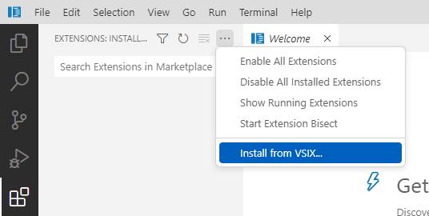

# Visual Studio Code - IDE rust

## How To Install
### Install Ide Rust
download from release
### Install extensions
Please Download and install the following extensions manually
### add parameter to argv.json
Modifying a configuration file argv.json
windows
```
C:\Users\Administrator\.vside-rust\argv.json
```
MacOS

add
``
"enable-proposed-api":["ms-python.python","ms-toolsai.rust"]
```
Use developer tools to check for other errors
```
Developer: Toggle Developer Tools
```

#### rust Support

Name: Rust Extension Pack
Id: swellaby.rust-pack
Description: Extension Pack for Rust
Version: 0.3.3
Publisher: Swellaby
VS Marketplace Link: https://marketplace.visualstudio.com/items?itemName=swellaby.rust-pack


### Install Exensions

